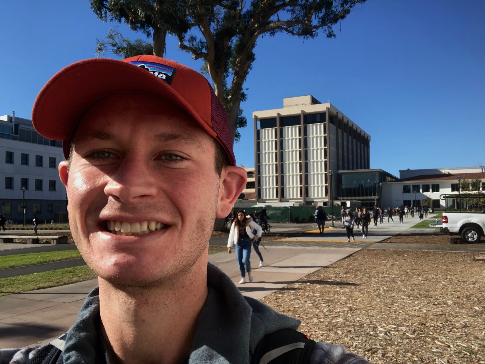

My name is Angus Watters and I am senior expecting to graduate in the Spring of 2021 with a B.A. in Geography with an emphasis on GIS at the University of California, Santa Barbara. I am proficient in both R and Python and able to work with large data sets to perform statistical and data analysis. I am interested in working in the field of water resources and environmental conservation. 

I am 23 years old and was born and raised in Santa Barbara, California. My interests include running, biking, art, computer science, and GIS. 

Email: adwattersgrubstein@umail.ucsb.edu

GitHub: https://github.com/anguswg-ucsb

