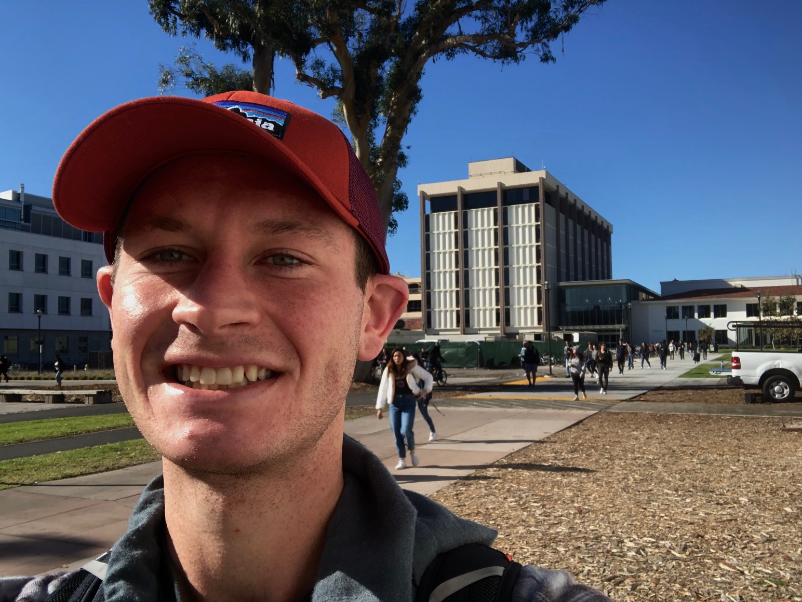

```{r, message= FALSE, warning = FALSE, echo = FALSE}
library(tidyverse)
library(rmarkdown)     # You need this library to run this template.
library(mikedown)   
```

#  **Welcome!**

------------------------------------------------------------------------

###

My name is Angus Watters and I'm a data scientists and geospatial data engineer at Lynker Technologies. I specialize in geospatial data collection, aggregation, statistical analysis, modeling, and visualization. I am passionate about all things data science and programming, and I try my best each day to improve myself and my technical skills.
 
In my free time I enjoy spending my time running, biking, working on puzzles, gardening, and cooking.

------------------------------------------------------------------------

#### **Email:** [anguswatters\@gmail.com](mailto:anguswatters@gmail.com){.email}<br>

#### **GitHub:**https://github.com/anguswg-ucsb

#### **LinkedIn:** https://www.linkedin.com/in/angus-watters-0521a7209/<br>

#### **Phone:** (805) 895-1590

<center></center>
