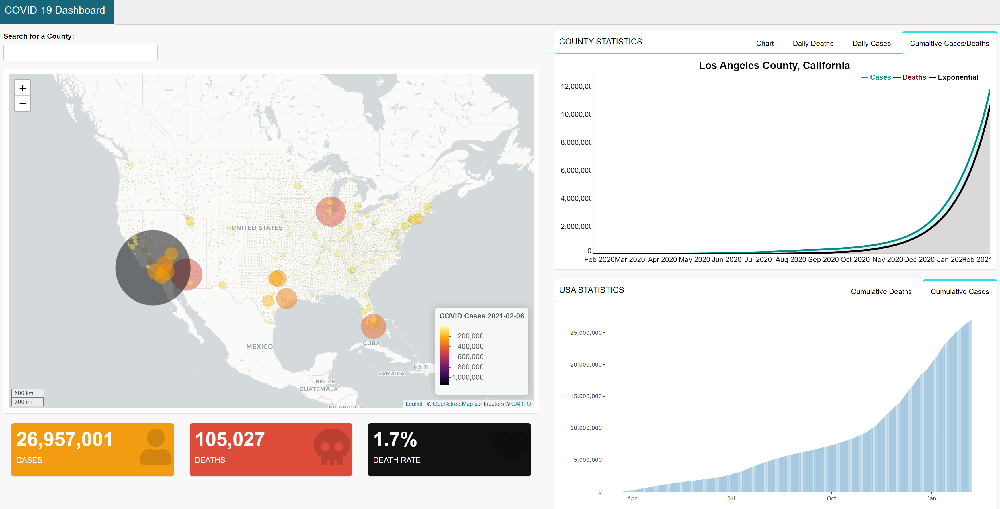

```{r, message= FALSE, warning = FALSE, echo = FALSE}
library(rmarkdown)     # You need this library to run this template.
library(mikedown)   
```

***
### **[COVID-19](https://angus-watters.shinyapps.io/covid-dashboard/)**

  - Built using R-Shiny dashboard

  - Tracking the COVID-19 pandemic in the United States

  - Built using R-Shiny dashboard
  
  - Independent project 
  
  - Data source: [New York Times](https://github.com/nytimes/covid-19-data)

<br>

  <center>

</center>

<br>
<br>
<br>

### **[USGS Groundwater](https://angus-watters.shinyapps.io/groundwater-dash/)**

  - Built using R-Shiny dashboard
  
  - Groundwater research under [Dr. Perrone](https://www.es.ucsb.edu/debra-perrone)
  
  - Data source: [USGS National Water Information System](https://waterdata.usgs.gov/nwis)

<br>

<center>

</center>
  
<br>  
<br>
<br>

### **[USGS Groundwater](https://anguswg-ucsb.github.io/groundwater_2/index.html)**

  - R Markdown

  - Groundwater research under [Dr. Perrone](https://www.es.ucsb.edu/debra-perrone)
  
  - Identical data and research shown in the USGS Groundwater Shiny dashboard project but this is written up in an rmarkdown document and deployed using GitHub Pages
  
  - Data source: [USGS National Water Information System](https://waterdata.usgs.gov/nwis)
  
<br>

### **[US dams](https://anguswg-ucsb.github.io/geog-176A-labs/lab-04.html)**

  - R Markdown

  - In this project I formed several tessellations over the US and then performed PIP analysis on dam locations within the US.
  
  - Methods used: Tesselations, Spatial Joins, Point-in-Polygon analysis, MAUP simplification

  - Data source: [National Dam Inventory, US Army Corps of Engineers](https://nid.sec.usace.army.mil/ords/f?p=105:1::::::)

<br>

### **[Palo, Iowa Flood - Rasters analysis and Remote Sensing](https://anguswg-ucsb.github.io/geog-176A-labs/lab-05.html)**

  - R Markdown

  - In this project I worked with rasters, RGB color variants, landsat images, and performed a K-means analysis to visualize regions were flooding has occurred.
  
  - Methods: Landsat raster extraction, Clustering, K-means analysis

<br>

### **[Santa Barbara, CA Mission Creek Flood - Terrain Analysis](https://anguswg-ucsb.github.io/geog-176A-labs/lab-06.html)**

  - R Markdown

  - In this project I used Open Street Map data to locate buildings and streams within a bounty box and then used Whitebox tools to analyze the terrain in the region.
  
  - Data source: [USGS National Water Information System](https://waterdata.usgs.gov/nwis)

<br> 

### **[COVID-19 Pandemic - Data Wrangling](https://anguswg-ucsb.github.io/geog-176A-labs/lab-02.html)**

  - R Markdown
  
  - Identical data and research shown in the COVID-19 Shiny dashboard project but written up in an rmarkdown document and deployed using GitHub Pages
  
  - Data source: [New York Times](https://github.com/nytimes/covid-19-data)
  
<br>

### **[US Cities - Projections, Distances, and Mapping](https://anguswg-ucsb.github.io/geog-176A-labs/lab-03.html)**

  - R Markdown

  - In this project I took US cities and borders, created Sf objects, and then performed spatial analysis.

<br>


