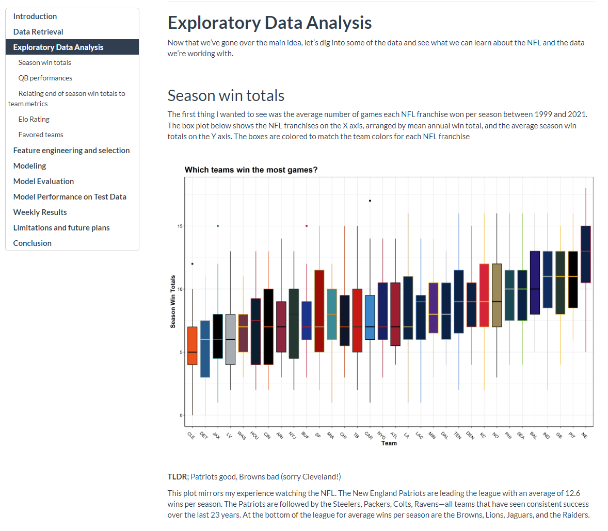
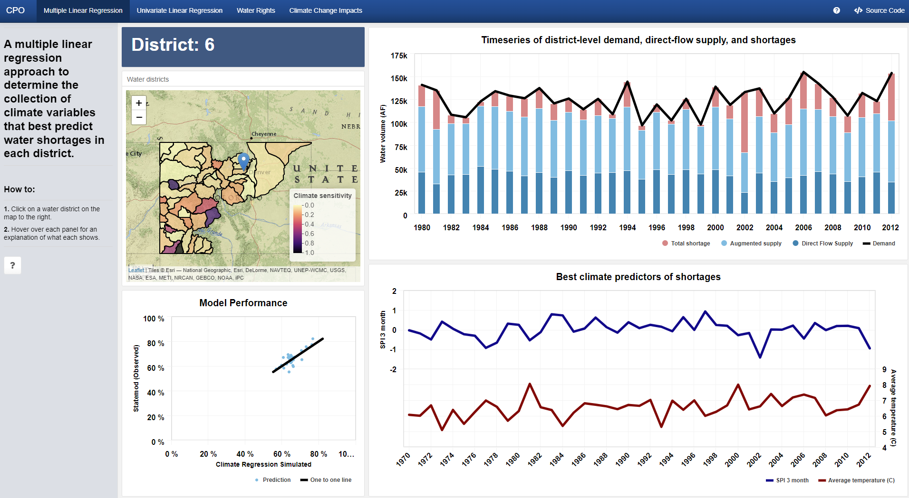

```{r, message= FALSE, warning = FALSE, echo = FALSE}
library(rmarkdown)     # You need this library to run this template.
library(mikedown)   
```

------------------------------------------------------------------------

### [**fetchr**](https://github.com/anguswg-ucsb/fetchr)

-   A R package that provides a fast and scalable raster based method for calculating wind fetch distances for water grid cells within land water raster data.

-   [Package vignette](https://anguswg-ucsb.github.io/fetchr/)

-   Author and maintainer

    {align="right" width="25%"}

<br> <br> <br>

<br> <br>
<br> <br>

------------------------------------------------------------------------

### [**cdssr**](https://github.com/anguswg-ucsb/cdssr)

-   A R package for exploring and requesting resources from the [CDSS REST API](https://dwr.state.co.us/Rest/GET/Help).

-   Author and maintainer

-   [Package vignette](https://anguswg-ucsb.github.io/cdssr/)

-   [CDSS](https://dwr.state.co.us/Tools) 


<br> <br> <br>
<br> <br>

------------------------------------------------------------------------

### [**Predicting NFL game winners using Machine Learning**](https://anguswg-ucsb.github.io/nfl_wins/)

-   A machine learning side project where I attempt to predict the winners of NFL games.

-   Data ingestion, cleansing, and modeling done in R

-   REST API for generating predictions is in progress.

-   Model write up was done in an Rmarkdown document.

-   Data source: [nflfastR](https://www.nflfastr.com/)

<center></center>

<br> <br> <br>
<br> <br>

------------------------------------------------------------------------

### [**nflpredictR**](https://github.com/anguswg-ucsb/nflpredictr)

-   R package for accessing and manipulating data from the [NFL Win Prediction model API](http://68.183.25.9:8000/__docs__/) I created for the project above.

-   Data sources: [Pro Football Reference](https://www.pro-football-reference.com/), [CBS Sports](https://www.cbssports.com/) 

<br> <br> <br>
<br> <br>

------------------------------------------------------------------------

### [**CPO**](https://lynkertech.shinyapps.io/cpo_dashboard/?_ga=2.109622853.1519925091.1658267834-2052221978.1652893159)

-   Built using R-Shiny

-   On-call shiny app for exploring [CDSS's StateMod](https://cdss.colorado.gov/software/statemod) data. StateMod is a monthly and daily surface water allocation and accounting model maintained by Colorado's Decision Support Systems

-   There are 4 tabs for different modeling efforts put forth to understand the interaction between climate variables and water shortages across water districts and for specific water right.

-   Data source: [CDSS](https://cdss.colorado.gov/)

<br>

<center></center>

<br> <br> <br>
<br> <br>

---------------------------------------------------------------------------

### [**Colorado Low head dam analysis**](https://lynkertech.shinyapps.io/aw_lhd_app/?_ga=2.259796298.154504578.1662220902-2052221978.1652893159)

-   Built using R-Shiny

-   On-call shiny app for exploring Low head damn locations in Colorado and the results of a risk analysis assessment done on each location.

<br>

<center></center>

<br> <br> <br>
<br> <br>

---------------------------------------------------------------------------

### [**NWIS Water use**](https://angus-watters.shinyapps.io/WaterUse/?_ga=2.243022978.1093189296.1618237032-1187783417.1609440081)

-   Built using R-Shiny

-   On-call shiny app for US water sector withdrawals by county

-   Accesses and visualizes NWIS Water use data in a Shiny GUI.

-   Data source: [USGS](https://waterdata.usgs.gov/nwis/wu)

<br>

<center></center>

<br> <br> <br>
<br> <br>

---------------------------------------------------------------------------

### [**National Water Model**](https://angus-watters.shinyapps.io/nwmHistoric/) **( UNDER CONSTRUCTION )**

-   Built using R-Shiny

-   On-call shiny app for data exploration

-   Facilitates access to NOAA National Water Model reanalysis data through a convenient Shiny GUI.

-   Data source: [NOAA](https://water.noaa.gov/about/nwm)

<br>

<center></center>

<br> <br> <br>
<br> <br>

---------------------------------------------------------------------------

### [**COVID-19**](https://angus-watters.shinyapps.io/covid-tracker/?_ga=2.209713810.1652100718.1619291563-1187783417.1609440081)

-   Built using R-Shiny dashboard

-   Tracking the COVID-19 pandemic in the United States

-   Independent project

-   Data source: [New York Times](https://github.com/nytimes/covid-19-data)

<br>

<center></center>

<br> <br> <br>
<br> <br>

---------------------------------------------------------------------------

### [**US dams**](https://anguswg-ucsb.github.io/geog-176A-labs/lab-04.html)

-   R Markdown

-   In this project I formed several tessellations over the US and then performed PIP analysis on dam locations within the US.

-   Methods used: Tesselations, Spatial Joins, Point-in-Polygon analysis, MAUP simplification

-   Data source: [National Dam Inventory, US Army Corps of Engineers](https://nid.sec.usace.army.mil/ords/f?p=105:1::::::)

<br>
<br> <br>

---------------------------------------------------------------------------

### [**Palo, Iowa Flood - Rasters analysis and Remote Sensing**](https://anguswg-ucsb.github.io/geog-176A-labs/lab-05.html)

-   R Markdown

-   In this project I worked with rasters, RGB color variants, landsat images, and performed a K-means analysis to visualize regions were flooding has occurred.

-   Methods: Landsat raster extraction, Clustering, K-means analysis

<br>
<br> <br>

---------------------------------------------------------------------------

### [**Santa Barbara, CA Mission Creek Flood - Terrain Analysis**](https://anguswg-ucsb.github.io/geog-176A-labs/lab-06.html)

-   R Markdown

-   In this project I used Open Street Map data to locate buildings and streams within a bounty box and then used Whitebox tools to analyze the terrain in the region.

-   Data source: [USGS National Water Information System](https://waterdata.usgs.gov/nwis)

<br>
<br> <br>

---------------------------------------------------------------------------

### [**COVID-19 Pandemic - Data Wrangling**](https://anguswg-ucsb.github.io/geog-176A-labs/lab-02.html)

-   R Markdown

-   I calculated the adjusted case rate, the number of new COVID-19 cases per 100,000 residents over a 7 day period, which the California government uses as a risk level criteria. I then created a county level choropleth map of California detailing county risk levels.

-   Data source: [New York Times](https://github.com/nytimes/covid-19-data)
